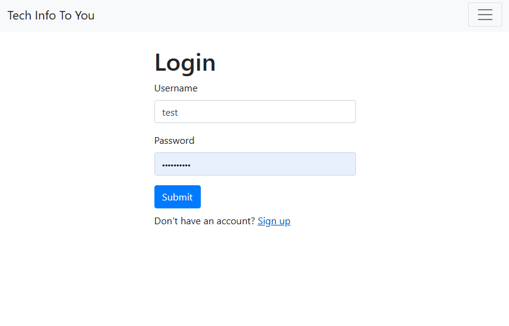
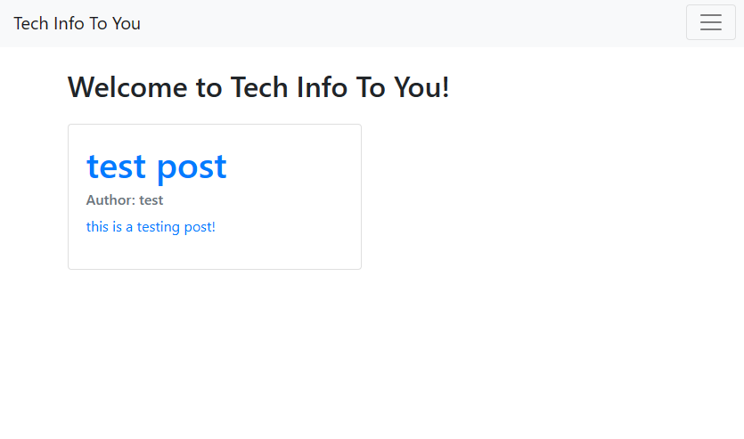

# tech-info-to-you

## 
  
# Table of Contents:
  
  1. [Description](#description)
  2. [Installation](#installation)
  3. [Usage](#usage)
  4. [Contributors](#contributors)
  5. [License](#license)
  6. [Screenshot](#screenshot)
  7. [Link](#link)
  8. [Tests](#tests)
  9. [Questions](#questions)
 10. [Citing Credit](#citing)
  
## Description 

    This is a fullstack blog website where you can make a profile, create posts and comment on others posts. You can share insights about tech, and coding, and comment on theres dialouge!

      
## Installation 

There is no instillation required you just have to visit the heroku website and sign up for an account!
## Usage 

  
 This will be most useful in creating blog posts about all things related to tech and sharing your insights on others peoples posts!

      
  
## Contributors 

 ttieman
  
## License 

  ### This application is covered under the [MIT LICENSE](https://opensource.org/licenses/MIT),
  and should be referred to for any questions about legal licensure considering 
  this application. 

## ScreenShot  

## Link

To the Application:
[https://serene-brushlands-66474.herokuapp.com](https://serene-brushlands-66474.herokuapp.com)  

To the Repo:
[https://github.com/ttieman/tech-info-to-you](https://github.com/ttieman/tech-info-to-you)  
  
  
## Tests 

### The tests ran for this application were done through user experience.
  
## Questions 

  
### If you have and questions my git hub user is [ttieman](https://github.com/ttieman)
  
### My email is tiemantanner@gmail.com if you wish to reach out to me directly.

## Citing Credit

 Web3 schools was used for referencing javascript elements while building this application!

 [https://www.w3schools.com/](https://www.w3schools.com/)

 The Sequalize package was used for this application and the documentation can be found here.

 [https://sequelize.org/docs/v6/](https://sequelize.org/docs/v6/)

 MySql2 was used to make this application and the documentation can be found here.

 [https://www.npmjs.com/package/mysql2](https://www.npmjs.com/package/mysql2)

Handlerbars was used for the front end view for this application found here

[https://handlebarsjs.com/guide/](https://handlebarsjs.com/guide/)